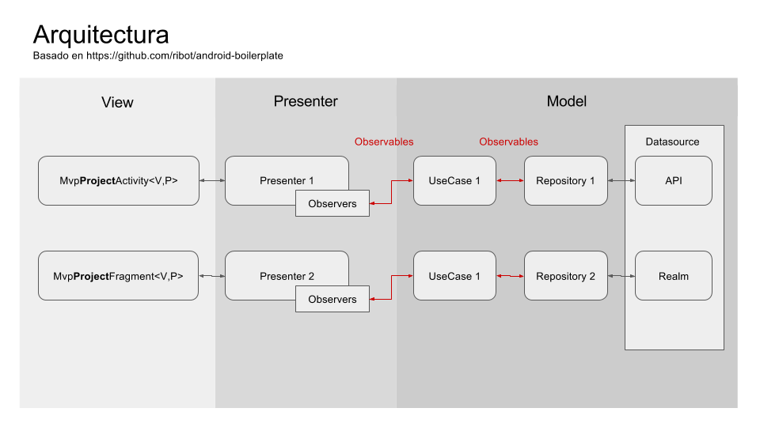
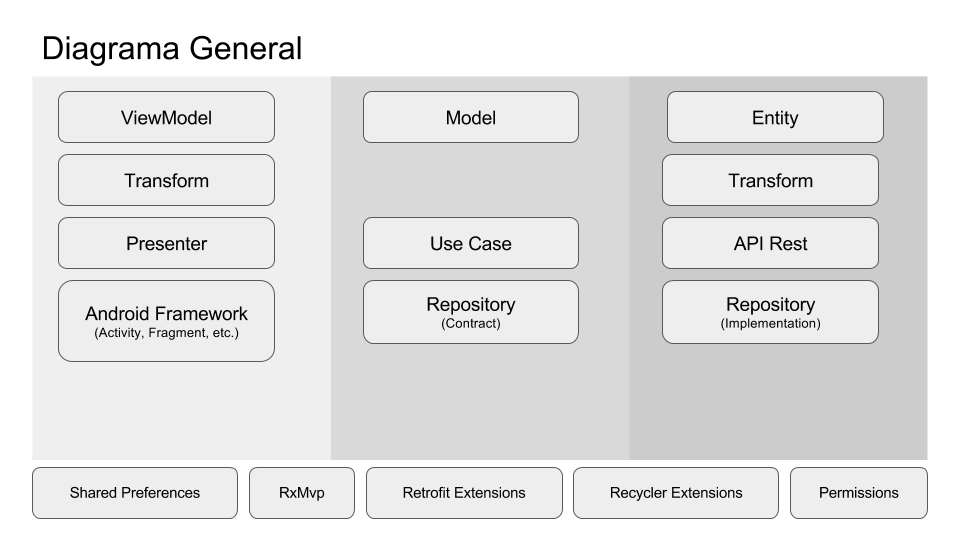
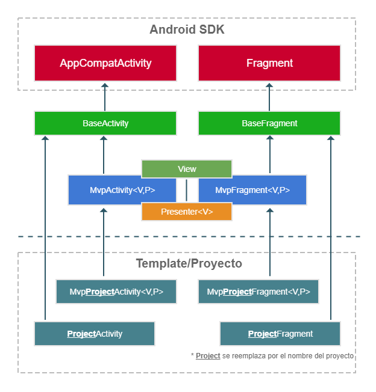

[](http://developer.android.com/index.html)

# Android Core MX #

Es un conjunto de módulos que incluyen utilerías base que permite a los desarrolladores crear aplicaciones robustas para Android implementando el patrón MVP de forma simple.

### Diagrama general ###


### Diagrama de arquitectura ###


### Diagrama MVP ###


#### Uso ####
__Paso 1.__ En el archivo `build.gradle` del proyecto, en la sección de `repositories` agregar la referencia de `maven { url 'https://jitpack.io' }` como se muestra a continuación:
```gradle
allprojects {
  repositories {
    ...
    maven { url 'https://jitpack.io' }
  }
}
```

__Paso 2.__ Agregar la dependencia de `coremx` en el archivo `build.gradle` de la aplicación/módulo

Gradle previas a 3.0.0

```gradle
   dependencies {
      compile 'com.github.androidmx:core-mx:develop-SNAPSHOT'
   }
```

Gradle 3.0.0+

```gradle
   dependencies {
      implementation 'com.github.androidmx:core-mx:develop-SNAPSHOT'
   }
```

__NOTA:__

Gradle puede almacenar en caché las compilaciones SNAPSHOT. Para asegurar que Gradle siempre elija la versión más reciente de la compilación, debes agregar la siguiente configuración en tu archivo `build.gradle` 

```gradle
configurations.all {
    resolutionStrategy.cacheChangingModulesFor 0, 'seconds'
}
```
### Permissions ###
Es el módulo que facilita el manejo de la solicitud de permisos al usuario.

__Paso 1.__ Implementa en la Activity o Fragment la interface de **PermisionsResult** estos métodos manejan la respuesta
 a la solicitud de los permisos, por ejemplo:

``` java 
public class DetailUserActivity extends CoreBaseActvity implements PermissionsResult {
    ...
    @Override
    public void onPermissionsGranted(int requestCode) {
        Log.i(DetailUserActivity.class.getName(), "Permissions Granted");
    }
    
    @Override
    public void onPermissionsDenied(int requestCode) {
        Log.i(DetailUserActivity.class.getName(), "Permissions denied");
    }
    
    @Override
    public void onPermissionsDeniedPermanently(int requestCode) {
        Log.i(DetailUserActivity.class.getName(), "Permissions denied permanent");
        
    }
    ...
    
}
```


__Paso 2.__ Inicializa `Permissions`, durante la inicialización se pueden configurar el título, mensaje y
 texto en las opciones del diálogo,  que se  le muestra
al usuario para  informarle el porqué de los permisos solicitados,  también se le pasa el contexto correspondiente
además de la interface implementada para el manejo de la respuesta a la solicitud de los permisos.
``` java
 permissionsCustom = new Permissions.Builder(Context context)
                .setPermissionsResult(PermissionsResult permissionsResult)
                .setDialogTitle(String value)
                .setDialogMessage(String value)
                .setDialogOkButtonText(String value)
                .setDialogCancelButtonText(String value)
                .build();
```


__Paso 3.__
Establece el grupo de permisos a usar en la aplicación, por ejemplo:
``` java 
    String[] permissionRequired = new String[]{
            Manifest.permission.CAMERA,
            Manifest.permission.WRITE_EXTERNAL_STORAGE
    };

```
__Paso 4.__ El método que inicia la comprobación y solicitud de los permisos es ``check```

``` java
    ... 

    permissionsCustom.check(permissionRequired,
                            PERMISSIONS_REQUEST_CAMERA,
                            ShowRequestPermissionRationale.AT_END,
                            "");
     ...
```
En este método se reciben como parámetros;
el grupo de permisos a solicitar, un request code, 
un entero que determina en qué 
momento se muestrará el dialogo explicando al usuario el porqué  de la solicitud de estos 
permisos y finalmente  se puede o no incluir 
un mensaje personalizado  para  mostar al usuario en el dialogo antes mencionado. 


__Paso 5.__ En el Activity o Fragment agrega el método **onRequestPermissionsResult**

``` java
    @Override
    public void onRequestPermissionsResult(int requestCode, @NonNull String[] permissions, @NonNull int[] grantResults) {
        super.onRequestPermissionsResult(requestCode, permissions, grantResults);
        if(permissions != null){
            permissionsCustom.onRequestPermissionsResult(requestCode, permissions, grantResults);
        }
    }

```


Practicas recomendadas para permisos:
https://developer.android.com/training/permissions/best-practices.html


### Manejo de errores ###
Este módulo permite el manejo y control de los errores que puedan retornar como respuesta a una petición. 

#### Uso ####

En el módulo **rxmvp** se toma la interface `ResponseError` para crear la clase que contendrá la estructura
del error que se espera recibir en la respuesta.
 
Por ejemplo: 

``` java 
 public class SimpleHandlerError implements ResponseError {
 
     @SerializedName("error")
     private String error;
 
 
     @Override
     public String getError() {
         return error;
     }
 
     @Override
     public boolean hasErrorMessage() {
         return error != null && !error.isEmpty();
     }
 }
```


Dentro del módulo de **retrofitextensions**  la clase  `HttpErrorHandling` sirve como clase base para 
obtener la descripción del error según el código retornado en la respuesta.

Para hacer uso de esta clase se tiene que crear una clase y heredar de  `HttpErrorHandling`, 
además de pasarle el contexto correspondiente.

Por ejemplo:

``` java
public class HttpErrorHandler extends HttpErrorHandling {

    public HttpErrorHandler(Context context) {
        super(context);
    }

}
```
Por defecto contiene unicamente el manejo de 6 códigos de error (de HttpUrlConnection), sí se desea
añadir un nuevo código de error se tendría que 
hacer uso de alguno de los siguientes métodos:

(key = codigo, value  =  R.string...)

``` java
public void put(Integer key, @StringRes Integer value) {
    mapCodes.put(key, getStringFromId(value));   
}
```    
o (key = codigo, value = cadena)
``` java
public void put(Integer key, String value) {
    mapCodes.put(key, value);
}
```

En el proyecto principal en capa de data se puede incluir dentro del directorio repository un directorio adicional 
llamado error, dentro de éste las clases que extienden o implementan las clases relacionadas al manejo de errores y que han 
sido expuestas en los apartados anteriores.

Por ejemplo:

(método usado en la clase repositorio)
``` java
...

@Override
public Single<String> registerUser(String email, String password) {
    Single<LoginResponse> response = api.registerUser(email, password);
    return response.map(new Function<LoginResponse, String>() {
        ...
        
    }).onErrorResumeNext(new
            RxErrorHandlerFunction<String, SimpleHandlerError>(context,
            SimpleHandlerError.class));
}

...

```
La clase RxErrorHandlerFunction para este ejemplo es la que se encarga de retornar 
el mensaje en caso de que la respuesta la incluya o bien regresar una descripción preestablecida deacuerdo al código retornado.

``` java
public class RxErrorHandlerFunction<T, E extends ResponseError>
        extends  ErrorHandlerFunction<Response>
        implements Function<Throwable, SingleSource<? extends T>> {
        
    private final Class<E> errorClass;    
        
    @Override
    public SingleSource<? extends T> apply(Throwable throwable) throws Exception {
        ...
        
        Response response = httpException.response();
        if(response.code() == HttpURLConnection.HTTP_UNAUTHORIZED){
            return Single.error(new UnauthorizedException());
        }
        return Single.error(getResponseState(response));
        
        ...
                    
    }
    
    @Override
    public ResponseState getResponseState(Response response) throws IOException {
        
        ...
        ResponseError responseError = gson.fromJson(jsonError, errorClass);
        ...
        
        if(null == errorMessage) {
            errorMessage = new HttpErrorHandler(context).getErrorByHttpCode(response.code());
        
        }
        
        return  new ResponseState(errorMessage, response.code());
    }
          
}
```

### Rx MVP ###
Consiste en una implementación del patrón MVP (Model View Presenter) utilizando los principios de clean architecture.

Se extiende funcionalidad mediante el uso de RxJava para Android


#### Uso ####

Cada RxMvp vista debe extender de `mx.gigigo.core.rxmvp.View`

``` java
public interface View { }
```

Cada RxMvp presenter debe extender de `mx.gigigo.core.rxmvp.Presenter` y debe recibir un parámetro (V) que extienda de `mx.gigigo.core.rxmvp.View` 

``` java
public interface Presenter<V extends View> {

    void attachView(V view);

    void detachView();

    void resume();

    void pause();

    void destroy();

    void handleError(Throwable exception);
}
```


Butter Knife for binding views en Activity/Fragment base.

#### Uso ####

Activity
``` java
import butterknife.ButterKnife;
import butterknife.Unbinder;

public abstract class MvpProjectNameActivity<V extends View, P extends Presenter<V>>
        extends MvpActivity<V, P> {

    private Unbinder unbinder;

    @Override
    protected void onBindView() {
        unbinder = ButterKnife.bind(this);
    }

    @Override
    protected void onUnbindView() {
        if(null != unbinder) unbinder.unbind();
    }
}
```

Fragment
``` java
import butterknife.ButterKnife;
import butterknife.Unbinder;

public abstract class MvpProjectNameFragment<V extends View, P extends Presenter<V>>
        extends MvpFragment<V, P> {

    private Unbinder unbinder;

    @Override
    protected void onBindView(android.view.View root) {
        unbinder = ButterKnife.bind(this, root);
    }

    @Override
    protected void onUnbindView() {
        if(null != unbinder) unbinder.unbind();
    }
}
```

__NOTA:__

Cuando el Activity/Fragment no requiera de una implementación de MVP, estos deberán extender de `mx.gigigo.core.rxmvp.BaseActivity` y `mx.gigigo.core.rxmvp.BaseFragment` respectivamente 

### SharedPreferences Extensions ###

Consiste en una extensión de SharedPreferences propias del SDK para simplificar su uso

#### Configuración inicial ####

``` java
SharedPreferencesExtensions
                .builder(context)
                .loggable(BuildConfig.DEBUG)
                .setName("name")
                .setMode(Context.MODE_PRIVATE)
                .build();
```

#### Uso ####

Para almacenar y recuperar valores se utiliza el Type, por tanto debemos tomar en cuenta lo siguiente: 
``` java
// Para colecciones utilizar com.google.gson.reflect.TypeToken
Type typeOfList = new TypeToken<List<T>>(){}.getType();

// Para primitivos, clases 
Type type = String.class || Boolean.class || CustomClass.class || ... T.class;
```

Almacenar cualquier tipo (primitivos, colecciones, clases ...)
``` java
SharedPreferencesExtensions
                .put(key, type, value, replace if exist /* optional, default true */);
```

Recuperar el valor original acorde al tipo (primitivos, colecciones, clases ...)
``` java
value = SharedPreferencesExtensions
                    .get(key, type, default value /* optional */);
```

Eliminar valores no necesarios
``` java
SharedPreferencesExtensions.delete(key);
```


### Retrofit Extensions ###

Consiste en una extensión de retrofit para simplificar su uso


#### Configuración inicial ####

``` java
LoggingInterceptor loggerInterceptor = new LoggingInterceptor.Builder()
                .loggable(BuildConfig.DEBUG)
                .setLevel(Level.BASIC)
                .log(Platform.INFO)
                .request("Request")
                .response("Response")
                .build();

        Gson gson = new GsonBuilder()
                .setDateFormat("yyyy-MM-dd HH:mm:ss")
                .serializeNulls()
                .create();

        
        NetworkRequestInterceptor requestInterceptor =
                new DefaultNetworkRequestInterceptor(new DefaultNetwork(context));
                
        OkHttpClient client = new OkHttpClient.Builder()
                .addInterceptor(loggerInterceptor)
                .addInterceptor(requestInterceptor)
                .connectTimeout(30, TimeUnit.SECONDS)
                .readTimeout(30, TimeUnit.SECONDS)
                .writeTimeout(30, TimeUnit.SECONDS)
                .build();

        ServiceClient.builder(client)
                .addEndpoint(endpoint) // puede agreger multiples endpoints
                .addConverterFactory(GsonConverterFactory.create(gson))
                .addCallAdapterFactory(RxJava2CallAdapterFactory.create())
                .build();
                
        ...
        
        
    private class DefaultNetworkRequestInterceptor
            extends NetworkRequestInterceptor {

        public DefaultNetworkRequestInterceptor(Network network) {
            super(network);
        }

        @Override
        protected Response interceptResponse(Chain chain) throws IOException {
            return chain.proceed(chain.request());
        }
    }

```

#### Uso ####

Crear una instancia del servicio (REST API methods) mediante un factory
``` java
ServiceClient serviceClient = ServiceClient.getDefault();

ServiceClientFactory.createService(service client, class type);
```


### Recycler Extensions ###

Consiste en una extensión de `RecyclerView.Adapter` y `RecyclerView.ViewHolder` para simplificar su uso y reducir la generación de código

### View Holder Adapter ###
Cada ViewHolder de RecyclerView deberá extender de `mx.gigigo.core.recyclerextensions.ViewHolderAdapter`
#### Uso ####
``` java
public class CustomViewHolder
        extends ViewHolderAdapter<data model> {

    TextView textViewName;

    public ListUsersViewHolder(View itemView) {
        super(itemView);
        
        textViewName = itemView.findViewById(R.id.text_view_name)
    }

    @Override
    public void onBindViewHolder(data model item) {
        super.onBindViewHolder(item);

        textViewName.setText("value");
    }
}

....

public class CustomAdapter
        extends RecyclerAdapter<data model> {

    @Override
    public ViewHolderAdapter<data model> onCreateViewHolder(ViewGroup parent, int viewType) {
        View view = getView(parent, R.layout.item_user);
        CustomViewHolder viewHolder = new CustomViewHolder(view);
        return viewHolder;
    }
    
```

### Recycler Adapter ###
Cada adapter de RecyclerView deberá extender de `mx.gigigo.core.recyclerextensions.RecyclerAdapter`

#### Uso ####
``` java
public class CustomAdapter
        extends RecyclerAdapter<data model> {

    @Override
    public ViewHolderAdapter<data model> onCreateViewHolder(ViewGroup parent, int viewType) {
        View view = getView(parent, R.layout.item_user);
        ViewHolderAdapter viewHolder = new ViewHolderAdapter(view);
        return viewHolder;
    }
}

....

CustomAdapter adapter = new CustomAdapter();

...

recyclerView.setAdapter(adapter);

```

Incluye métodos como:

* isEmpty()
* add(T item)
* addRange(Iterable<T> items)
* addRange(T... items)
* set(Iterable<T> items)
* set(T... items)
* update(T item)
* remove(T item)
* remove(int index)
* where(IPredicate<T> predicate)
* clear()
* items()

### Recycler Header and Footer Adapter ###
Cada adapter de RecyclerView con funcionalidad de Header y/o Footer deberá extender de `mx.gigigo.core.recyclerextensions.RecyclerHeaderFooterAdapter`

#### Uso ####
``` java
public class CustomHeaderFooterAdapter
        extends RecyclerHeaderFooterAdapter<data model, ViewHolderAdapter<data model>> {

    @Override
    public ViewHolderAdapter<data model> onCreateViewHolderHeaderFooter(ViewGroup parent, int viewType) {
        View view = getView(parent, R.layout.item_user);
        ViewHolderAdapter viewHolder = new ViewHolderAdapter(view);
        return viewHolder;
    }
}

....

CustomHeaderFooterAdapter adapter = new CustomHeaderFooterAdapter();

...

recyclerView.setAdapter(adapter);

adapter.setHeaderView(recyclerView, R.layout.template_header);
adapter.setFooterView(recyclerView, R.layout.template_footer);

```

### Eventos de BaseActivity y BaseFragment ###

``` java
// region ProjectNameActivity Methods

@Override
protected int getLayoutId() {
    return R.layout.layout_id;
}

@Override
protected void onRestoreExtras(Bundle arguments) {
    super.onRestoreExtras(arguments);
}

@Override
protected void onInitializeMembers() {
    ...
}

@Override
protected void onInitializeUIComponents() {
    ...
}

@Override
protected Presenter createPresenter() {
    ...
}

// endregion ProjectNameActivity Methods

```

##### Uso ####

Se agregaron los siguientes métodos para agrupar y estandarizar las inicializaciones de objetos y 
referencias de Views y a continuación se explica su uso: 

* `onRestoreExtras(Bundle arguments)`: Se utiliza para extraer los datos existentes en el `Bundle` al 
crear una nueva instancia de un Activity o un Fragment, este objeto se verifica en el evento 
`onCreate` del `BaseActivity` y `BaseFragment`, si en la verificación el `Bundle` es `null` no se 
invocará este método. Esta llamada ocurre antes del `onInitializeMembers` y `onInitializeUIComponents`.
* `onInitializeMembers`: Aquí se inicializarán todas las variables y objetos de la clase que no 
dependan directamente de la existencia de alguna referencia de la vista.
* `onInitializeUIComponents`: Aquí se inicializarán las referencias de componentes de vistas.

### Estandarización de estructura en Activity y Fragment ###
``` java
public class MainActivity
        extends ProjectNameActivity {
    
    // region Constants
    
    private static final String PAGE_NUMBER_ARG = "page_number_arg";
    
    // endregion Constants
    
    // region UI Components
    
    @BindView(R.id.viewpager_sections)
    ViewPager sectionsViewPager;
    
    // endregion UI Components
    
    // region Members
    
    private HomePagerAdapter homePagerAdapter;
    
    // endregion Members
    
    // region Activity Lifecycle
    
    @Override
    protected void onResume() {
        super.onResume();
        ...
    }
        
    // endregion Activity Lifecycle
    
    // region ProjectNameActivity Methods
    
    @Override
    protected int getLayoutId() {
        return R.layout.activity_main;
    }

    ...
    
    // endregion ProjectNameActivity Methods
    
    // region View Implementation
    // endregion View Implementation
    
    // region ButterKnife View Events
    
    @OnClick(R.id.image_view_avatar)
    public void onAvatarButtonClick() {
        ...
    }
    
    // endregion ButterKnife View Events
    
    // region Public Methods
    // endregion Public Methods
    
    // region Private Methods
    
    private List<Fragment> createFragmentPages(int number) {
        ...
    }
    
    // endregion Private Methods
}
```

``` java

```
